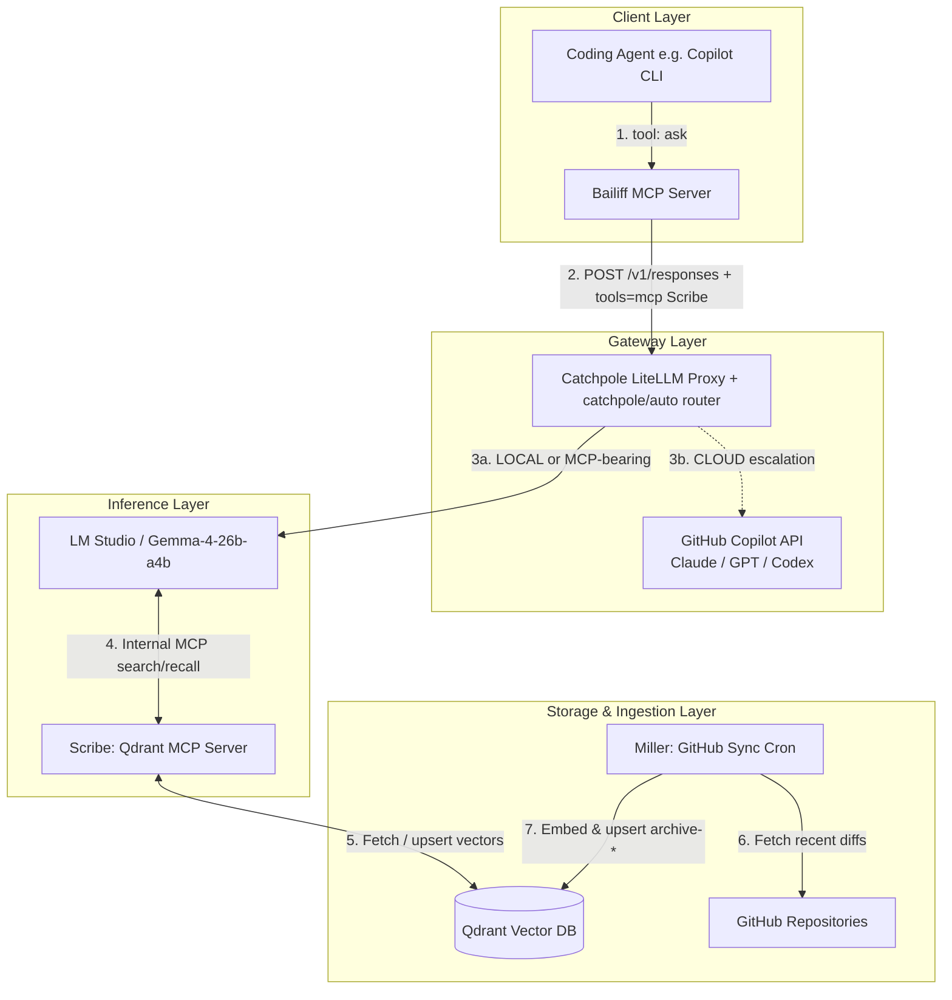

# System Architecture Specification: The Chamberlain Architecture

## 1. Executive Summary

The Chamberlain Architecture is a four-pillar AI ecosystem designed to provide highly contextual, agentic capabilities to a local or cloud-based coding agent. It decouples the client execution, API routing, inference, and memory ingestion into discrete microservices. This allows a coding agent to query a continuously updated vector database of private repositories without flooding the client's context window with raw database chunks.

### The Pillars (KCD Administrative Theme)

| Pillar        | Role                  | Description                                                                              |
| ------------- | --------------------- | ---------------------------------------------------------------------------------------- |
| **Catchpole** | The Gateway           | The LiteLLM routing layer handling front-facing traffic.                                 |
| **Scribe**    | The Record Keeper     | The RAG MCP server attached to the inference engine.                                     |
| **Miller**    | The Background Grinder| The continuous repository synchronisation cron job.                                      |
| **Bailiff**   | The Delegate          | The client-side MCP server wrapping the entire backend.                                  |
| **Crier**     | The Town Voice        | Embedded NPU-accelerated SLM library, imported in-process for the smallest local calls.  |

---

## 2. Global Architecture Diagram



**Deployment topology:** all four pillars run as Docker containers with `network_mode: host`. A top-level `docker-compose.yaml` at the repo root uses Compose's `include:` directive to bring up Catchpole, Scribe, Miller (with Qdrant) and optionally Bailiff in one shot; each pillar's own compose file remains the source of truth.

---

## 3. Pillar 1: Project Catchpole (The Gateway)

- **Role:** API Gateway and Intelligent Router.
- **Tech Stack:** LiteLLM proxy (Docker) + a custom `CustomLLM` provider (`catchpole.py`) registered as the `catchpole` provider.

Catchpole is the single point of entry for Bailiff and any other OpenAI-compatible client. It binds on `http://localhost:4000` via `network_mode: host`, so LM Studio on the same host is reachable at `http://localhost:1234/v1` directly (no `host.docker.internal` shim required on Linux / mirrored-WSL networking; the legacy `host.docker.internal:host-gateway` entry is kept only as a safety net).

### 3.1 Model surface

`litellm_config.yaml` exposes three classes of model:

| Model id | Backend | Notes |
| --- | --- | --- |
| `catchpole/auto` | Custom router (this provider) | Decides LOCAL vs CLOUD per request. The primary entry point Bailiff uses. |
| `lm_studio/local` | LM Studio | Resolves to `$CATCHPOLE_LOCAL_MODEL` (default `openai/google/gemma-4-26b-a4b`). `mode: responses` so it accepts MCP tool blocks. |
| `lm_studio/nomic-embed-text-v1.5` | LM Studio | Embedding model used by Scribe and Miller. |
| `github_copilot/*` | GitHub Copilot API | Fan-out of Claude Sonnet/Opus, GPT-5.x, and Codex variants; OAuth token cached in the `copilot-auth` Docker volume. Codex models use `mode: responses`. |

### 3.2 `catchpole/auto` routing logic

Implemented in `catchpole.py`:

1. **MCP-tools override.** If the incoming request carries any `{"type": "mcp"}` tool block (i.e. it is RAG over private data, as Bailiff's payloads always are), the request is forced to `LOCAL` regardless of complexity. Private archive content must never escape to a cloud provider.
2. **Complexity probe.** Otherwise the local model is asked to classify the request as `LOCAL` (simple boilerplate / lookup) or `CLOUD` (deep context, complex logic). On any router error the call defaults to `CLOUD`.
3. **Forward.** The original request is re-issued via `litellm.completion` against either `$CATCHPOLE_LOCAL_MODEL` (LM Studio) or `$CATCHPOLE_CLOUD_MODEL` (default `github_copilot/claude-sonnet-4.6`).

Oversized messages are summarised before the router probe so the routing decision itself never consumes the full prompt budget.

**Flow:** `Client → Catchpole (route) → LM Studio` or `Client → Catchpole (route) → GitHub Copilot`

---

## 4. Pillar 2: Project Scribe (The Record Keeper)

- **Role:** The Inference-Layer Memory capability.
- **Tech Stack:** FastMCP, Qdrant DB, LM Studio, Jina/Nomic Embeddings.

The Scribe is an MCP server attached directly to LM Studio, not the client. When LM Studio receives a prompt routed by Catchpole, it combines the prompt with the Scribe tool schema. If the LLM needs context from the archives, scratch pads, or stored memories, it triggers Scribe to query Qdrant, synthesises the retrieved chunks, and returns only the final text.

True to the medieval scribe role, this pillar both **retrieves** existing records and **records** new ones. It serves three distinct kinds of recall surface, each with its own lifetime and trust profile:

| Prefix          | Lifetime              | Source                          | Granularity        | Mutability                     |
| --------------- | --------------------- | ------------------------------- | ------------------ | ------------------------------ |
| `archive-*`     | Persistent            | Miller (cron, GitHub repos)     | Chunks of files    | Rebuilt wholesale by Miller    |
| `scratch-*`     | Ephemeral (TTL / GC)  | Scribe `ingest_*` tools         | Chunks of pages    | Delete-whole-collection        |
| `memory-default`| Persistent, curated   | Scribe `remember` tool          | One fact per point | Per-entry insert / forget      |

**Flow:** `LM Studio -> Scribe -> Qdrant` (reads and writes)

**Deployment:** Runs alongside Qdrant in `docker-compose`. Uses FastMCP with streamable-http transport (the legacy SSE transport is deprecated and is not reliably picked up by current MCP clients). For `ingest_path` to access on-disk corpora, the compose file mounts a host directory at `/drop` inside the container; only paths under `/drop` are accepted.

**LM Studio `mcp.json`:**

```json
{
  "mcpServers": {
    "scribe": {
      "url": "http://localhost:8000/mcp"
    }
  }
}
```

> **Important:** LM Studio injects MCP tools only into its native chat UI and into the `/v1/responses` and `/api/v1/chat` endpoints. The OpenAI-compatible `/v1/chat/completions` endpoint does NOT receive MCP tools. Bailiff and any other API consumer that wants Scribe-backed RAG must use `/v1/responses` upstream.

### 4.1 Tool Surface

Scribe exposes three groups of tools. Tool descriptions are purely descriptive. Any "recall before search" or other usage policy lives in the calling agent's system prompt, not in Scribe.

**Search (read-only):**

| Tool | Description |
| --- | --- |
| `search_archives(query, collection="all", limit=5)` | Embed the query and search. Fan-out covers `archive-*` and `scratch-*` collections. **Does not include `memory-*`** — memories must be queried explicitly via `recall`. |
| `list_collections()` | Enumerate indexed collections with point counts and status. |

**Ingest (writes `scratch-*`):**

| Tool | Description |
| --- | --- |
| `ingest_url(url, collection, max_pages=1)` | Fetch a URL, extract main text, chunk, embed, upsert into `scratch-<collection>`. Subject to the SSRF allowlist (see 4.3). |
| `ingest_path(path, collection)` | Read files under `/drop/<path>` inside the container, chunk, embed, upsert into `scratch-<collection>`. Paths escaping `/drop` are rejected. |
| `forget_collection(collection)` | Delete a `scratch-*` collection in full. Refuses to touch `archive-*` or `memory-*` collections. |

**Memory (writes `memory-default`, point-granular):**

| Tool | Description |
| --- | --- |
| `remember(fact, subject, reason, citations)` | Store a single curated fact. All four fields are mandatory. `citations` records provenance (file path, line numbers, or `User input: "<exact quote>"`). |
| `recall(query, subject=None, limit=5)` | Semantic search over `memory-default`, optionally filtered by `subject`. Returns full payloads (fact, subject, citations, score), not synthesised prose. |
| `forget(memory_id, reason)` | Delete a single memory point by id. The `reason` is written to a sidecar audit log, not stored in Qdrant. |
| `list_memories(subject=None)` | Enumerate stored memories, optionally filtered by `subject`. |

### 4.2 Memory Payload Schema

Borrowed directly from the GitHub Copilot Memory schema, which is battle-tested for provenance and concision:

| Field | Type | Notes |
| --- | --- | --- |
| `fact` | string, ≤ 200 chars | The claim itself. The length cap forces concision. |
| `subject` | string, 1-2 words | Topical tag, e.g. `deployment`, `architecture`. |
| `reason` | string | Why this fact was stored and which future tasks it serves. |
| `citations` | string | Provenance. Either file references (`path/file.go:123`) or exact user quotations (`User input: "<exact quote>"`). |
| `created_at` | timestamp | Set by Scribe at insert time. Enables age-based GC later. |

### 4.3 Safety Gates

Three non-negotiable guards live in Scribe itself, because once the LLM has a write tool it will use it broadly:

1. **SSRF allowlist on `ingest_url`.** Scheme must be `http` or `https`. Resolved IPs must not be in RFC1918, link-local, loopback, or cloud metadata ranges (notably `169.254.169.254` and IPv6 equivalents). Response size capped (default 5 MB). Per-call timeout (default 30 s).
2. **Path containment on `ingest_path`.** Resolved real path must be a descendant of `/drop`. Symlinks that escape are rejected.
3. **Secret and PII refusal on `remember`.** Heuristic gate rejects content matching common credential patterns (API keys, JWTs, private key headers, connection strings) and refuses GDPR Article 9 categories. Refusal is loud (tool returns an error the model can see), not silent.

### 4.4 Out of Scope for v1

Deliberately deferred to avoid premature complexity:

- `update_memory` (covered by `forget` + `remember`).
- Memory voting (`upvote` / `downvote`) for relevance reinforcement.
- Multi-namespace memory (`memory-<scope>`); the single `memory-default` collection is sufficient until a second scope is genuinely needed.
- Automatic age-based GC of memories or scratch collections; relies on explicit `forget` / `forget_collection` for now.
- Multi-tenant isolation; Scribe is single-user today and memory would be the first thing to leak under multi-tenancy.

---

## 5. Pillar 3: Project Miller (The Background Grinder)

- **Role:** Continuous, incremental repository ingestion.
- **Tech Stack:** Docker, Cron, `maholick/github-qdrant-sync`.

The Miller operates completely out-of-band from the main administrative loop. Grinding away quietly in the background, it wakes up every 10 minutes, checks configured local or remote Git repositories, and hashes the files. It chunks and embeds only the diffs/changes using a multimodal embedder and "smuggles" them into the Qdrant database.

**Flow:** `GitHub/Local Files -> Miller -> Qdrant DB`

**Deployment:** Co-located with Qdrant in `miller/docker-compose.yaml` (Qdrant is the storage layer shared by Miller's writes and Scribe's reads). Lightweight Python container, cron-driven (`MILLER_SCHEDULE`, default `*/10 * * * *`), with `MILLER_RUN_AT_START=1` triggering an immediate sync on boot. Repository set is declared in `config/repositories.yaml`; embedder defaults to the same `text-embedding-nomic-embed-text-v1.5` LM Studio endpoint that Scribe uses, so query- and ingest-time embeddings are vector-compatible.

**Key Benefit:** Keeps the Scribe's memory state perfectly in sync with the codebase without requiring manual re-indexing or burning excess compute.

---

## 6. Pillar 4: Project Bailiff (The Delegate)

- **Role:** Client-side Proxy Tool.
- **Tech Stack:** Python, FastMCP SDK, `httpx`.

The Bailiff is the only component the Coding Agent interacts with. It presents a single MCP tool (`ask`) to the agent. When the agent calls `ask(query)`, Bailiff POSTs to the upstream's OpenAI `/v1/responses` endpoint (Catchpole at `http://localhost:4000` by default) and **attaches an MCP tool block pointing at Scribe** in the same request. The upstream model — running inside LM Studio behind Catchpole — autonomously calls Scribe's tools during inference and returns a synthesised answer. Bailiff unwraps `output_text` and hands it back.

The `/v1/responses` endpoint is mandatory: LM Studio only injects MCP tools into requests routed through `/v1/responses` and its native chat API. The OpenAI-compatible `/v1/chat/completions` endpoint silently drops MCP tool blocks.

**Flow:** `Coding Agent → Bailiff → Catchpole → LM Studio ↔ Scribe ↔ Qdrant`

### 6.1 Outbound payload

```python
payload = {
    "model": UPSTREAM_MODEL,            # default "local"; typically "catchpole/auto"
    "input": query,
    "instructions": load_system_prompt(),
    "tools": [
        {
            "type": "mcp",
            "server_label": KNOWLEDGE_LABEL,        # default "knowledge"
            "server_url": KNOWLEDGE_URL,            # default http://localhost:8000/mcp
            "allowed_tools": KNOWLEDGE_ALLOWED_TOOLS,
        }
    ],
}
```

`KNOWLEDGE_URL` is fetched by the **upstream** (LM Studio), not by Bailiff itself, so it must resolve from the LM Studio host's network namespace. When LM Studio runs on a different host (e.g. Windows + WSL), this is the most common deployment gotcha.

By default `KNOWLEDGE_ALLOWED_TOOLS` exposes the full Scribe v1 surface (`search_archives`, `list_collections`, `recall`, `remember`, `forget`, `list_memories`, `ingest_url`, `ingest_path`, `forget_collection`). The legacy `KNOWLEDGE_TOOL` env var still works as a single-tool override for back-compat.

### 6.2 System prompt ownership

Bailiff is the canonical owner of the instructions sent to the LM Studio model on every `/v1/responses` request. This matters because Scribe is attached at the inference layer, so the **LM Studio model** — not the coding agent — is the only consumer that sees Scribe's tool surface. Any usage policy for those tools must therefore live in Bailiff's outbound `instructions`.

The prompt covers three policy categories:

| Category               | Intent                                                                                                                                |
| ---------------------- | ------------------------------------------------------------------------------------------------------------------------------------- |
| Memory usage           | When to call `recall` (explicit user reference to prior context, preferences, or decisions). When to call `remember` (durable, citable facts the user has asserted). Recall and remember are never automatic; the policy spells out the trigger conditions. |
| Archive search         | When to call `search_archives` (factual questions about the codebase corpus). What to do with low-confidence results.                  |
| Ingest restraint       | When `ingest_url` / `ingest_path` are appropriate (explicit user request to load a source) versus when to refuse and ask the user.    |

The prompt is **data, not code**, loaded with the following precedence:

1. `BAILIFF_INSTRUCTIONS` env var (inline override), if set.
2. File at `BAILIFF_SYSTEM_PROMPT_FILE` (default `/app/system_prompt.md`), if present.
3. Built-in minimal fallback string in the code.

A default `system_prompt.md` ships in the repo; deployments override it via a read-only volume mount.

**Key Benefit:** Saves client context tokens. The Coding Agent receives a finished, citation-bearing answer instead of raw JSON chunks from a vector database, and the policy governing the heavy Scribe tool surface lives outside the agent's context window entirely.

---

## 7. Pillar 5: Project Crier (The Town Voice)

- **Role:** Embedded NPU-accelerated small-language-model library.
- **Tech Stack:** Python library, ONNX Runtime GenAI, vendor execution providers (Vitis AI / OpenVINO / QNN / CoreML / DirectML / CPU).

Crier is a deliberate departure from the existing pillars: it is a **library** consumed in-process, not a service. There is no HTTP hop, no Docker container, no separate model loader. A Python component (initially Catchpole, eventually anything in Chamberlain) imports Crier and calls `LLM.load(...).generate(...)` directly against the local NPU, GPU, or CPU.

The motivation: the other pillars all assume an external inference engine (LM Studio on the host). For the smallest, fastest, most-private calls — routing decisions, short classifications, lightweight summaries — round-tripping to LM Studio is overkill. Crier collapses that path into an in-process call against a small (≤4B parameter) instruct-tuned model running on the host NPU.

### 7.1 Public surface

```python
from crier import LLM, Message, GenerationConfig

llm = LLM.load(
    model="phi-3.5-mini-instruct",
    accelerator="auto",              # cpu | directml | coreml | ryzenai | openvino | qnn | cuda
    require_acceleration=False,      # refuse silent CPU fallback when True
)

print(llm.info)  # BackendInfo with attempted backends + fallback_reason

reply = llm.generate(messages, GenerationConfig(max_tokens=128))
for chunk in llm.stream(messages, config): ...
async for chunk in llm.astream(messages, config): ...
```

Models are described by a `ModelSpec` dataclass; logical preset names (e.g. `phi-3.5-mini-instruct`) resolve to a per-backend `ModelSpec`. Local paths and explicit specs are first-class — the preset table is a convenience, not a contract.

### 7.2 Backend matrix and install story

Each backend ships as a pip extra (`crier[ryzenai]`, `crier[openvino]`, etc.) because vendor wheels conflict with each other. The pip extra installs the Python binding; it does **not** install the vendor system stack (XDNA driver, Intel NPU driver, QNN runtime). Crier exposes `crier doctor` (and `crier.probe()`) as the canonical diagnostic surface, returning one row per backend that distinguishes:

- Python package not installed (pip command in the hint).
- Package installed but provider not registered (driver missing).
- Provider registered but session init failed (incompatible model / hardware).

### 7.3 Concurrency contract

One `LLM` instance supports one active generation at a time. The instance holds an internal lock that serialises calls; parallelism means multiple instances. This is loud rather than clever on purpose — native ORT GenAI sessions hold model weights in NPU memory and re-entrancy semantics vary by EP.

### 7.4 Integration with Catchpole (future)

Crier is consumed in-process. The intended Catchpole integration adds a third routing target, `EMBEDDED`, alongside the existing `LOCAL` (LM Studio) and `CLOUD` (GitHub Copilot) targets:

| Decision | Target | Used for |
| --- | --- | --- |
| `EMBEDDED` | Crier (in-process via NPU) | Tiny, latency-sensitive calls: the routing decision itself, simple lookups, structured-output asks small enough for a 3B model. |
| `LOCAL` | LM Studio + Scribe MCP | RAG-bearing requests, larger local model. |
| `CLOUD` | GitHub Copilot | Deep context / heavy reasoning, when no MCP tools are attached. |

The current `catchpole/auto` flow makes Crier optional: if the import fails or the backend is unavailable, the router behaves exactly as today.

### 7.5 Deployment

There is no Crier container. The pillar consists of `crier/`, a standalone Python package published from this submodule. Consumers add `crier` to their `requirements.txt` and the appropriate extra for the deployment host.

### 7.6 Out of scope for v1

- Embeddings API (ORT GenAI exposes embedding support; defer until a consumer needs it).
- MLX backend for Apple Silicon (CoreML EP is good enough for now; MLX is sharper but adds a second native dependency).
- Function / tool calling pass-through.
- Multi-instance pooling and queueing (callers manage their own pool).
