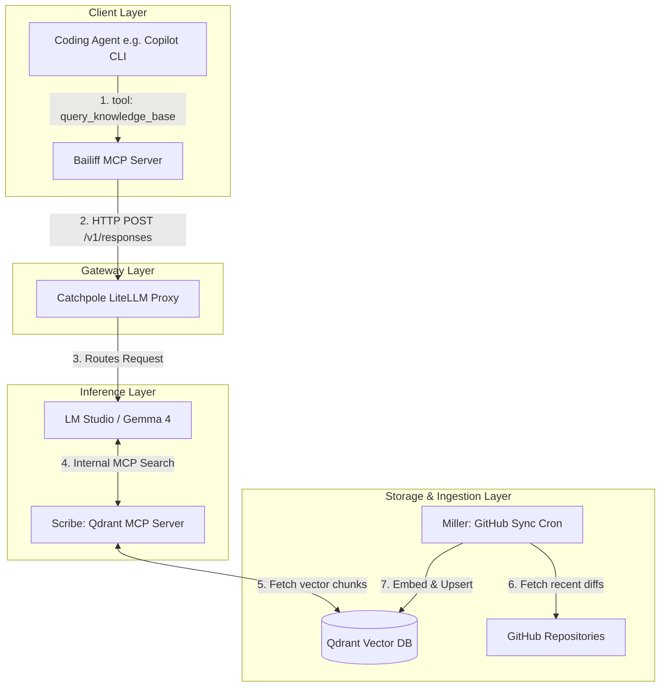

# System Architecture Specification: The Chamberlain Architecture

## 1. Executive Summary

The Chamberlain Architecture is a four-pillar AI ecosystem designed to provide highly contextual, agentic capabilities to a local or cloud-based coding agent. It decouples the client execution, API routing, inference, and memory ingestion into discrete microservices. This allows a coding agent to query a continuously updated vector database of private repositories without flooding the client's context window with raw database chunks.

### The Four Pillars (KCD Administrative Theme)

| Pillar        | Role                  | Description                                                       |
| ------------- | --------------------- | ----------------------------------------------------------------- |
| **Catchpole** | The Gateway           | The LiteLLM routing layer handling front-facing traffic.          |
| **Scribe**    | The Record Keeper     | The RAG MCP server attached to the inference engine.              |
| **Miller**    | The Background Grinder| The continuous repository synchronisation cron job.               |
| **Bailiff**   | The Delegate          | The client-side MCP server wrapping the entire backend.           |

---

## 2. Global Architecture Diagram



---

## 3. Pillar 1: Project Catchpole (The Gateway)

- **Role:** API Gateway and Intelligent Router.
- **Tech Stack:** LiteLLM (Python/Docker).

Catchpole acts as the single point of entry for the Bailiff MCP or any other direct API consumers. It presents a unified OpenAI-compatible endpoint and routes traffic based on model requests or custom logic (e.g., routing complex requests to cloud providers and internal domain queries to local LM Studio).

**Flow:** `Client -> Catchpole -> LM Studio`

**Key Configuration:** A `litellm_config.yaml` mapping the `gemma-4` alias to the local LM Studio endpoint (`http://host.docker.internal:1234/v1`).

---

## 4. Pillar 2: Project Scribe (The Record Keeper)

- **Role:** The Inference-Layer Memory capability.
- **Tech Stack:** `mcp-server-qdrant`, Qdrant DB, LM Studio, Jina/Nomic Embeddings.

The Scribe is an MCP server attached directly to LM Studio, not the client. When LM Studio receives a prompt routed by Catchpole, it combines the prompt with the Scribe tool schema. If the LLM needs context from the "archives," it triggers the Scribe to query Qdrant, synthesises the retrieved chunks, and returns only the final text.

**Flow:** `LM Studio -> Scribe (mcp-server-qdrant) -> Qdrant`

**Deployment:** Runs alongside Qdrant in `docker-compose`. Uses FastMCP with streamable-http transport (the legacy SSE transport is deprecated and is not reliably picked up by current MCP clients).

**LM Studio `mcp.json`:**

```json
{
  "mcpServers": {
    "scribe": {
      "url": "http://localhost:8000/mcp"
    }
  }
}
```

> **Important:** LM Studio injects MCP tools only into its native chat UI and into the `/v1/responses` and `/api/v1/chat` endpoints. The OpenAI-compatible `/v1/chat/completions` endpoint does NOT receive MCP tools. Bailiff and any other API consumer that wants Scribe-backed RAG must use `/v1/responses` upstream.

---

## 5. Pillar 3: Project Miller (The Background Grinder)

- **Role:** Continuous, incremental repository ingestion.
- **Tech Stack:** Docker, Cron, `maholick/github-qdrant-sync`.

The Miller operates completely out-of-band from the main administrative loop. Grinding away quietly in the background, it wakes up every 10 minutes, checks configured local or remote Git repositories, and hashes the files. It chunks and embeds only the diffs/changes using a multimodal embedder and "smuggles" them into the Qdrant database.

**Flow:** `GitHub/Local Files -> Miller -> Qdrant DB`

**Deployment:** A lightweight Python container running cron.

**Key Benefit:** Keeps the Scribe's memory state perfectly in sync with the codebase without requiring manual re-indexing or burning excess compute.

---

## 6. Pillar 4: Project Bailiff (The Delegate)

- **Role:** Client-side Proxy Tool.
- **Tech Stack:** Python, FastMCP SDK.

The Bailiff is the only component the Coding Agent interacts with. It presents a single MCP tool (`query_knowledge_base`) to the agent. When the agent needs answers about the estate (codebase), the Bailiff wraps the query in an OpenAI-compatible payload and delegates it to Catchpole.

**Flow:** `Coding Agent -> Bailiff -> Catchpole`

**Tool Schema Definition:**

```python
@mcp.tool(name="query_knowledge_base")
async def query_knowledge_base(query: str) -> str:
    """
    Query the unified local engineering knowledge base and synchronized repository context.
    """
    # Sends HTTP request to Catchpole API URL
    # Returns synthesized markdown response
```

**Key Benefit:** Saves massive amounts of client context tokens. The Coding Agent receives a highly curated, fully synthesised answer from the Scribe instead of raw JSON chunks from a vector database.
