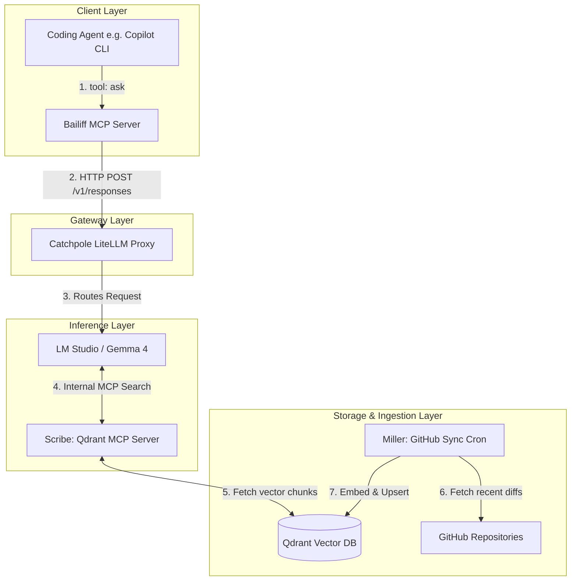

# System Architecture Specification: The Chamberlain Architecture

## 1. Executive Summary

The Chamberlain Architecture is a four-pillar AI ecosystem designed to provide highly contextual, agentic capabilities to a local or cloud-based coding agent. It decouples the client execution, API routing, inference, and memory ingestion into discrete microservices. This allows a coding agent to query a continuously updated vector database of private repositories without flooding the client's context window with raw database chunks.

### The Four Pillars (KCD Administrative Theme)

| Pillar        | Role                  | Description                                                       |
| ------------- | --------------------- | ----------------------------------------------------------------- |
| **Catchpole** | The Gateway           | The LiteLLM routing layer handling front-facing traffic.          |
| **Scribe**    | The Record Keeper     | The RAG MCP server attached to the inference engine.              |
| **Miller**    | The Background Grinder| The continuous repository synchronisation cron job.               |
| **Bailiff**   | The Delegate          | The client-side MCP server wrapping the entire backend.           |

---

## 2. Global Architecture Diagram



---

## 3. Pillar 1: Project Catchpole (The Gateway)

- **Role:** API Gateway and Intelligent Router.
- **Tech Stack:** LiteLLM (Python/Docker).

Catchpole acts as the single point of entry for the Bailiff MCP or any other direct API consumers. It presents a unified OpenAI-compatible endpoint and routes traffic based on model requests or custom logic (e.g., routing complex requests to cloud providers and internal domain queries to local LM Studio).

**Flow:** `Client -> Catchpole -> LM Studio`

**Key Configuration:** A `litellm_config.yaml` mapping the `gemma-4` alias to the local LM Studio endpoint (`http://host.docker.internal:1234/v1`).

---

## 4. Pillar 2: Project Scribe (The Record Keeper)

- **Role:** The Inference-Layer Memory capability.
- **Tech Stack:** FastMCP, Qdrant DB, LM Studio, Jina/Nomic Embeddings.

The Scribe is an MCP server attached directly to LM Studio, not the client. When LM Studio receives a prompt routed by Catchpole, it combines the prompt with the Scribe tool schema. If the LLM needs context from the archives, scratch pads, or stored memories, it triggers Scribe to query Qdrant, synthesises the retrieved chunks, and returns only the final text.

True to the medieval scribe role, this pillar both **retrieves** existing records and **records** new ones. It serves three distinct kinds of recall surface, each with its own lifetime and trust profile:

| Prefix          | Lifetime              | Source                          | Granularity        | Mutability                     |
| --------------- | --------------------- | ------------------------------- | ------------------ | ------------------------------ |
| `archive-*`     | Persistent            | Miller (cron, GitHub repos)     | Chunks of files    | Rebuilt wholesale by Miller    |
| `scratch-*`     | Ephemeral (TTL / GC)  | Scribe `ingest_*` tools         | Chunks of pages    | Delete-whole-collection        |
| `memory-default`| Persistent, curated   | Scribe `remember` tool          | One fact per point | Per-entry insert / forget      |

**Flow:** `LM Studio -> Scribe -> Qdrant` (reads and writes)

**Deployment:** Runs alongside Qdrant in `docker-compose`. Uses FastMCP with streamable-http transport (the legacy SSE transport is deprecated and is not reliably picked up by current MCP clients). For `ingest_path` to access on-disk corpora, the compose file mounts a host directory at `/drop` inside the container; only paths under `/drop` are accepted.

**LM Studio `mcp.json`:**

```json
{
  "mcpServers": {
    "scribe": {
      "url": "http://localhost:8000/mcp"
    }
  }
}
```

> **Important:** LM Studio injects MCP tools only into its native chat UI and into the `/v1/responses` and `/api/v1/chat` endpoints. The OpenAI-compatible `/v1/chat/completions` endpoint does NOT receive MCP tools. Bailiff and any other API consumer that wants Scribe-backed RAG must use `/v1/responses` upstream.

### 4.1 Tool Surface

Scribe exposes three groups of tools. Tool descriptions are purely descriptive. Any "recall before search" or other usage policy lives in the calling agent's system prompt, not in Scribe.

**Search (read-only):**

| Tool | Description |
| --- | --- |
| `search_archives(query, collection="all", limit=5)` | Embed the query and search. Fan-out covers `archive-*` and `scratch-*` collections. **Does not include `memory-*`** — memories must be queried explicitly via `recall`. |
| `list_collections()` | Enumerate indexed collections with point counts and status. |

**Ingest (writes `scratch-*`):**

| Tool | Description |
| --- | --- |
| `ingest_url(url, collection, max_pages=1)` | Fetch a URL, extract main text, chunk, embed, upsert into `scratch-<collection>`. Subject to the SSRF allowlist (see 4.3). |
| `ingest_path(path, collection)` | Read files under `/drop/<path>` inside the container, chunk, embed, upsert into `scratch-<collection>`. Paths escaping `/drop` are rejected. |
| `forget_collection(collection)` | Delete a `scratch-*` collection in full. Refuses to touch `archive-*` or `memory-*` collections. |

**Memory (writes `memory-default`, point-granular):**

| Tool | Description |
| --- | --- |
| `remember(fact, subject, reason, citations)` | Store a single curated fact. All four fields are mandatory. `citations` records provenance (file path, line numbers, or `User input: "<exact quote>"`). |
| `recall(query, subject=None, limit=5)` | Semantic search over `memory-default`, optionally filtered by `subject`. Returns full payloads (fact, subject, citations, score), not synthesised prose. |
| `forget(memory_id, reason)` | Delete a single memory point by id. The `reason` is written to a sidecar audit log, not stored in Qdrant. |
| `list_memories(subject=None)` | Enumerate stored memories, optionally filtered by `subject`. |

### 4.2 Memory Payload Schema

Borrowed directly from the GitHub Copilot Memory schema, which is battle-tested for provenance and concision:

| Field | Type | Notes |
| --- | --- | --- |
| `fact` | string, ≤ 200 chars | The claim itself. The length cap forces concision. |
| `subject` | string, 1-2 words | Topical tag, e.g. `deployment`, `architecture`. |
| `reason` | string | Why this fact was stored and which future tasks it serves. |
| `citations` | string | Provenance. Either file references (`path/file.go:123`) or exact user quotations (`User input: "<exact quote>"`). |
| `created_at` | timestamp | Set by Scribe at insert time. Enables age-based GC later. |

### 4.3 Safety Gates

Three non-negotiable guards live in Scribe itself, because once the LLM has a write tool it will use it broadly:

1. **SSRF allowlist on `ingest_url`.** Scheme must be `http` or `https`. Resolved IPs must not be in RFC1918, link-local, loopback, or cloud metadata ranges (notably `169.254.169.254` and IPv6 equivalents). Response size capped (default 5 MB). Per-call timeout (default 30 s).
2. **Path containment on `ingest_path`.** Resolved real path must be a descendant of `/drop`. Symlinks that escape are rejected.
3. **Secret and PII refusal on `remember`.** Heuristic gate rejects content matching common credential patterns (API keys, JWTs, private key headers, connection strings) and refuses GDPR Article 9 categories. Refusal is loud (tool returns an error the model can see), not silent.

### 4.4 Out of Scope for v1

Deliberately deferred to avoid premature complexity:

- `update_memory` (covered by `forget` + `remember`).
- Memory voting (`upvote` / `downvote`) for relevance reinforcement.
- Multi-namespace memory (`memory-<scope>`); the single `memory-default` collection is sufficient until a second scope is genuinely needed.
- Automatic age-based GC of memories or scratch collections; relies on explicit `forget` / `forget_collection` for now.
- Multi-tenant isolation; Scribe is single-user today and memory would be the first thing to leak under multi-tenancy.

---

## 5. Pillar 3: Project Miller (The Background Grinder)

- **Role:** Continuous, incremental repository ingestion.
- **Tech Stack:** Docker, Cron, `maholick/github-qdrant-sync`.

The Miller operates completely out-of-band from the main administrative loop. Grinding away quietly in the background, it wakes up every 10 minutes, checks configured local or remote Git repositories, and hashes the files. It chunks and embeds only the diffs/changes using a multimodal embedder and "smuggles" them into the Qdrant database.

**Flow:** `GitHub/Local Files -> Miller -> Qdrant DB`

**Deployment:** A lightweight Python container running cron.

**Key Benefit:** Keeps the Scribe's memory state perfectly in sync with the codebase without requiring manual re-indexing or burning excess compute.

---

## 6. Pillar 4: Project Bailiff (The Delegate)

- **Role:** Client-side Proxy Tool.
- **Tech Stack:** Python, FastMCP SDK.

The Bailiff is the only component the Coding Agent interacts with. It presents a single MCP tool (`ask`) to the agent. When the agent needs answers about the estate (codebase), the Bailiff wraps the query in an OpenAI-compatible payload and delegates it to Catchpole.

**Flow:** `Coding Agent -> Bailiff -> Catchpole`

**Tool Schema Definition:**

```python
@mcp.tool(name="ask")
async def ask(query: str) -> str:
    """
    Ask the unified local engineering knowledge base a natural-language
    question and receive a synthesised answer (not raw vector chunks).
    """
    # Sends HTTP request to Catchpole API URL
    # Returns synthesized markdown response
```

**Key Benefit:** Saves massive amounts of client context tokens. The Coding Agent receives a highly curated, fully synthesised answer from the Scribe instead of raw JSON chunks from a vector database.

### 6.1 System Prompt Ownership

Bailiff is the canonical owner of the system prompt sent to the LM Studio model on every `/v1/responses` request. This matters because Scribe is attached at the inference layer, so the **LM Studio model**, not the coding agent, is the only consumer that sees Scribe's tool surface (`search_archives`, `recall`, `remember`, `ingest_*`, etc.). Any usage policy for those tools must therefore live in Bailiff's outbound system message.

The system prompt covers three policy categories:

| Category               | Intent                                                                                                                                |
| ---------------------- | ------------------------------------------------------------------------------------------------------------------------------------- |
| Memory usage           | When to call `recall` (explicit user reference to prior context, preferences, or decisions). When to call `remember` (durable, citable facts the user has asserted). Recall and remember are never automatic; the policy spells out the trigger conditions. |
| Archive search         | When to call `search_archives` (factual questions about the codebase corpus). What to do with low-confidence results.                  |
| Ingest restraint       | When `ingest_url` / `ingest_path` are appropriate (explicit user request to load a source) versus when to refuse and ask the user.    |

The prompt itself is **data, not code**: loaded from a file path configured by `BAILIFF_SYSTEM_PROMPT_FILE` (default `./system_prompt.md`), so the policy can be edited and reloaded without rebuilding the container. A sensible default ships in the repo; deployments are expected to override it.

Bailiff's outbound payload becomes:

```python
messages = [
    {"role": "system", "content": load_system_prompt()},
    {"role": "user",   "content": query},
]
```

This is the **only** change to Bailiff required by the Scribe expansion in §4. The `ask` tool surface to the coding agent is unchanged.
